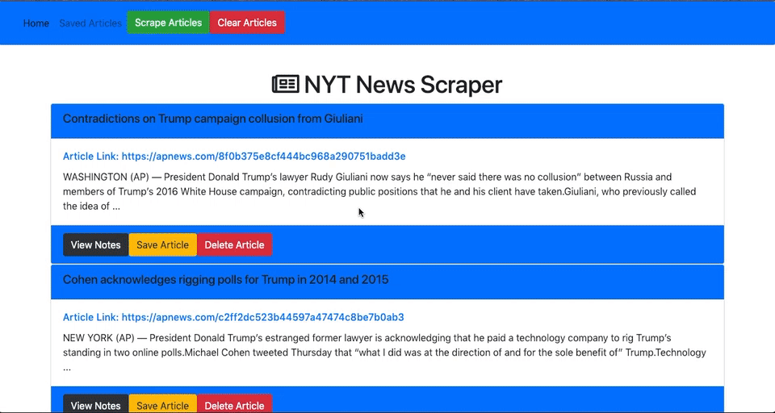
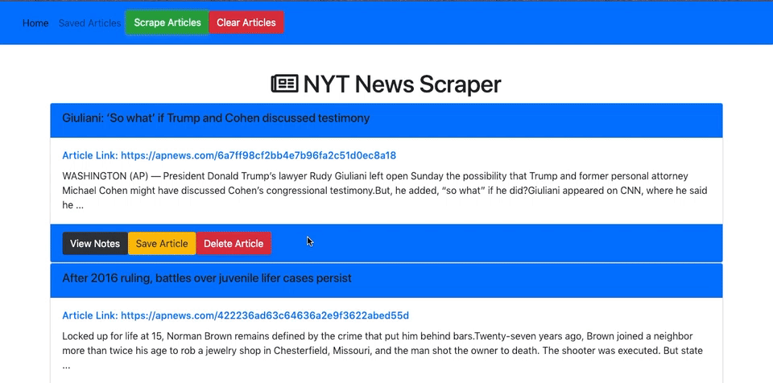

# News-Scraper #

## Heroku Link https://scrape-dat-news.herokuapp.com/ ##

## Overview ## 
This is a full-stack app which scrapes the New York Times for artices and displays them on our page.

## NPM's Used ## 
* Axios
* Cheerio
* Express
* Express-Handlebars
* Mongoose
* Morgan

## Functionality ##
When you open the app, an alert pops up saying that articles are being scraped from the database. The headline, link to the article and a short summary are filled in. 
You also have the ability to write and delete notes about the artices and see what other people have written.

-----------------------------------------------------------------------------------------------------------

In case that isn't fun enough, you can also delete articles, clear all the current articles AND save articles for later.
*(this functionality is not currently working, but the buttons are there)*

-----------------------------------------------------------------------------------------------------------

